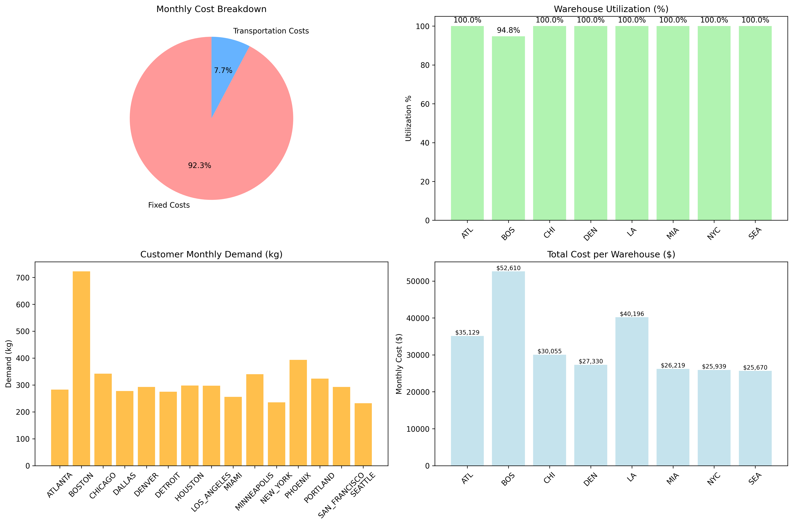

# Supply Chain Network Optimization

##  Project Overview
Optimized a national distribution network using **Mixed-Integer Linear Programming (MILP)** to minimize costs while meeting customer demand across 15 major US cities. This project demonstrates end-to-end data analysis from raw data to business recommendations.

##  Key Achievements
- **22.6% monthly cost reduction** ($76,922 savings)
- **$923,072 annual savings** identified  
- **5,438% ROI** over 3 years
- **Optimal 8-warehouse network** serving 15 cities

##  Demo

*Cost breakdown, warehouse utilization, and demand distribution*

##  Quick Start

### Prerequisites
- Python 3.8+
- pip package manager

### Installation & Run
Quick Start (Run Complete Analysis)
To install dependencies and run the entire analysis pipeline with one command:
# 1. Clone the repository
git clone https://github.com/yourusername/supply-chain-optimization.git
cd supply-chain-optimization

# 2. Install dependencies
pip install -r requirements.txt

# 3. Run the complete analysis
python run_all.py

### Run Individual Steps
For development or debugging, you can execute the analysis step-by-step:
bash
# Step 1: Data preparation
python src/01_data_transformation.py

# Step 2: Optimization
python src/02_optimization_model.py

# Step 3: Visualization (Charts & graphs)
python src/03_visualization.py

# Step 4: Business analysis
python src/04_business_insights.py

### Project Structure
supply-chain-optimization/
├── data/                    # Input and processed data files
├── src/                     # Source code
│   ├── 01_data_transformation.py
│   ├── 02_optimization_model.py
│   ├── 03_visualization.py
│   └── 04_business_insights.py
├── docs/                    # Additional documentation
├── results/                 # Output visualizations and reports
└── run_all.py              # One-click runner script

### Technical Implementation
# Methodology
Mathematical Optimization: Mixed-Integer Linear Programming (MILP)
Data Source: 2,000+ real shipment records
Objective Function: Minimize Total Cost = Fixed Costs + Transportation Costs
Constraints: Demand satisfaction, capacity limits, strategic warehouse count

# Key Features
(List of key features would go here)
